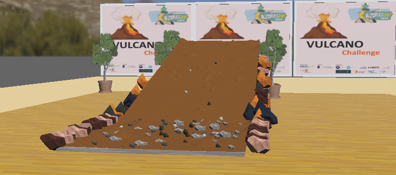

# Chalenge Rules 

#### PT 

##### Cenário 

O vulcão está numa fase ativa e no interior da cratera existe um lago de lava a temperaturas altíssimas emanando gases tóxicos para qualquer ser vivo. A tua tarefa é construir um robot capaz de se aproximar da cratera e tirar alguns parâmetros através de sensores.

##### Desafio

O robot terá de subir uma rampa no final da qual existe uma fonte de radiação infravermelha (700 nm ~ 1100 nm) e de calor. A rampa tem um comprimento de 3,5 metros por 95 cm de largura e a sua superfície é revestida por bagacina (lapilli) parcialmente solta, com uma inclinação de aproximadamente 15º. 
No início da rampa existe uma linha de partida/chegada e no cimo da rampa uma outra linha, de cor vermelha, laranja ou amarela, que indicará o ponto onde o robot deverá inverter a marcha, descendo a rampa.

O robot ganha pontos da seguinte forma:

- Ao atingir o topo da rampa e parar na linha vermelha - 5 pontos
- Regressar ao ponto de partida após atingir a linha vermelha - 5 pontos

##### Regras

1. As equipas podem ser constituídas por um máximo de 5 alunos e um tutor. As equipas serão divididas em dois grupos em função das médias de idade dos elementos das mesmas, sem contar com o tutor. A idade mínima dos elementos da equipa é de 9 anos:
    1. Grupo 1 - a média de idades da equipa não pode ultrapassar os 15 anos.
    2. Grupo 2 - a média de idades da equipa é superior a 15 anos.

2. O robô utilizado por cada equipa deverá ter no máximo 30 cm de comprimento e 25 de largura e ser completamente autónomo. Deverá ser maioritariamente desenvolvido pelas equipas. Não serão permitidos produtos comerciais ou kits nos quais os alunos não tenham participado no seu desenvolvimento. Neste primeiro desafio a organização disponibilizará um robô tipo que pode ser alterado pelas equipas durante o período de montagem e durante o período de prova. 

3. O robô poderá ser equipado com qualquer tipo de roda, wheg ou um misto das duas. Não serão permitidos sistemas que usem lagartas nem qualquer tipo de roda ou wheg comercial. São permitidos robôs que usem pernas, desde que estas tenham sido produzidas pelas próprias equipas.

4. 
